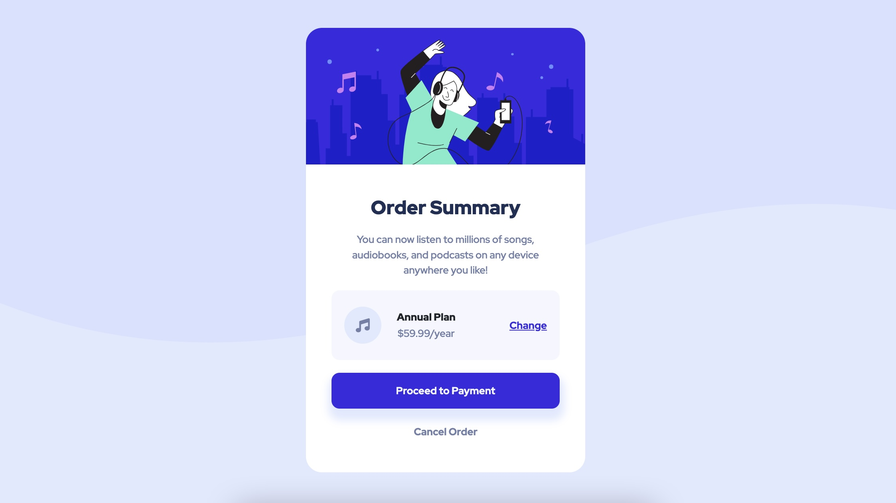

# Frontend Mentor - Order Summary Component

This is a solution to the <a href="https://www.frontendmentor.io/challenges/order-summary-component-QlPmajDUj">"Order Summary Component"</a> on Frontend Mentor.
<br>
Frontend Mentor challenges help ypu improve your coding skills by building realistic projects.

# 📖 Table of contents

- [Brief](#📋-brief);
- [Screenshot](#🖥-screenshot);
- [Technologies](#🔧-technologies);
- [Code](#💾-code);
- [Author](#🧔-author);

# 📋 Brief

Build out a Order summary component and get it looking as close to the design as possible.
<br>
Use any tools to help the completion of the challenge.
<br>
Users should be able to:
<br>

- View the optimal layout depending on their device's screen size;

# 🖥 Screenshot



# 🔧 Technologies


# 💾 Code

```html
<body>
	<div class="container-fluid">
		<div class="card-container">
			<div class="top-row">
				
			</div>
			<div class="bottom-row">
				<div class="information">
					<h1>Order Summary</h1>
					<p>
						You can now listen to millions of songs, audiobooks, and podcasts on
						any device anywhere you like!
					</p>
				</div>
				<div class="plan-info">
					<i class="fas fa-music"></i>
					<div class="plan-info-data">
						<p id="plan-type">Annual Plan</p>
						<p id="plan-price">$59.99/year</p>
					</div>
					<a href="#">Change</a>
				</div>
				<div class="order-info">
					<button class="btn">Proceed to Payment</button>
					<a href="#" class="cancel">Cancel Order</a>
				</div>
			</div>
		</div>
	</div>
</body>
```

```css
/* fonts */

@import url('https://fonts.googleapis.com/css2?family=Red+Hat+Display:wght@500;700;900&display=swap');

/* color palette */

:root {
	--color-dark-blue: hsl(223, 47%, 23%);
	--color-bright-blue: hsl(245, 75%, 52%);
	--color-desaturated-blue: hsl(224, 23%, 55%);
	--color-pale-blue: hsl(225, 100%, 94%);
	--color-very-pale-blue: hsl(225, 100%, 98%);
}

/* default reset */

* {
	margin: 0;
	padding: 0;
	box-sizing: border-box;
}

body {
	font-family: 'Red Hat Display', sans-serif;
	background-color: var(--color-pale-blue);
	background-image: url(images/pattern-background-desktop.svg);
	background-repeat: no-repeat;
}

p {
	font-size: 16px;
}

/* main container */

.container-fluid {
	width: 100%;
	min-height: 100vh;
	position: relative;
	display: flex;
	align-items: center;
	justify-content: center;
	padding: 2rem;
	overflow: hidden;
}

/* card container & rows */

.card-container {
	width: 100%;
	max-width: 350px;
	border-radius: 20px;
	background: #fff;
	overflow: hidden;
}

.top-row img {
	width: 100%;
}

.bottom-row {
	padding: 2.5rem 2rem;
	text-align: center;
}

/* information */

.information h1 {
	font-weight: 900;
	font-size: 1.5rem;
	color: var(--color-dark-blue);
}

.information p {
	padding-top: 0.5rem;
	font-weight: 500;
	font-size: 0.8rem;
	color: var(--color-desaturated-blue);
}

/* plan info */

.plan-info {
	padding: 0.5rem 1rem;
	display: flex;
	align-items: center;
	justify-content: space-between;
	border-radius: 10px;
	background: var(--color-very-pale-blue);
}

.plan-info i {
	padding: 0.9rem;
	font-size: 1.1rem;
	color: var(--color-desaturated-blue);
	border-radius: 100px;
	background: var(--color-pale-blue);
}

.plan-info-data {
	display: block;
	margin-top: 1rem;
	margin-right: 3rem;
}

#plan-type {
	font-weight: 900;
	font-size: 0.8rem;
}

#plan-price {
	margin-top: -15px;
	font-weight: 500;
	font-size: 0.8rem;
	color: var(--color-desaturated-blue);
}

.plan-info a {
	font-weight: 700;
	font-size: 0.8rem;
	color: var(--color-bright-blue);
}

.plan-info a:hover {
	color: hsl(243, 76%, 66%);
}

/* order info */

.order-info {
	margin-top: 1rem;
}

.btn {
	display: block;
	width: 100%;
	padding: 0.8rem 0;
	margin-bottom: 1rem;
	font-weight: 700;
	font-size: 0.8rem;
	color: var(--color-very-pale-blue);
	border-radius: 10px;
	background: var(--color-bright-blue);
	box-shadow: 1px 10px 10px 5px var(--color-pale-blue);
	border: none;
}

.btn:hover {
	color: var(--color-very-pale-blue);
	background: hsl(243, 76%, 66%);
	border: none;
}

.cancel {
	font-weight: 700;
	font-size: 0.8rem;
	color: var(--color-desaturated-blue);
	text-decoration: none;
}

.cancel:hover {
	color: var(--color-dark-blue);
}

@media (max-width: 500px) {
	.plan-info {
		padding: 0.2rem 1rem;
	}

	.plan-info-data {
		margin-right: 1.5rem;
	}
}

@media (max-width: 375px) {
	.plan-info-data {
		margin-right: 1rem;
	}
}
```

# 🧔 Author

- <a href="https://github.com/ynncstslv" target="_blank">GitHub</a>;
- <a href="https://linkedin.com/in/ynncstslv" target="_blank">LinkedIn</a>;
- <a href="https://codepen.io/ynncstslv" target="_blank">Codepen</a>;
- <a href="https://instagram.com/ynncstslv" target="_blank">Instagram</a>;
- <a href="https://twitter.com/ynncstslv" target="_blank">Twitter</a>;
